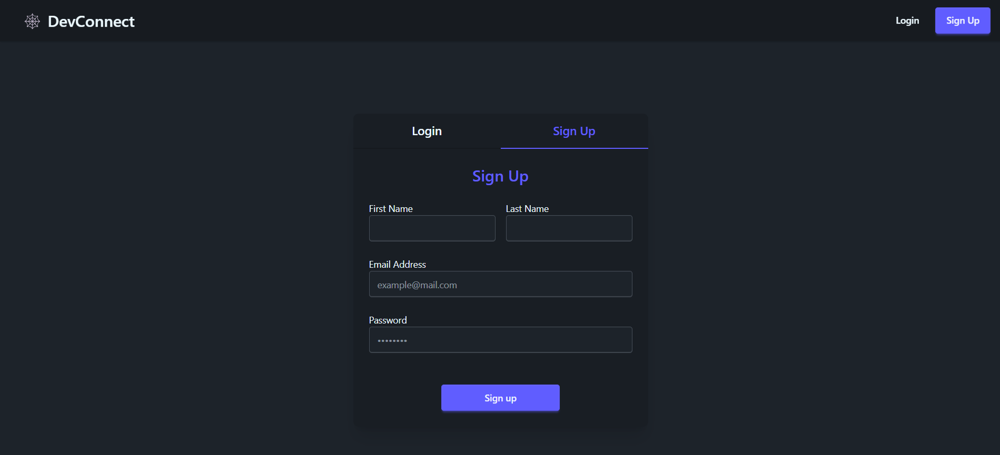
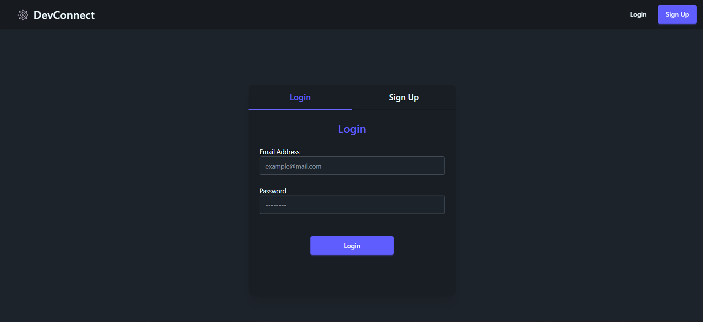
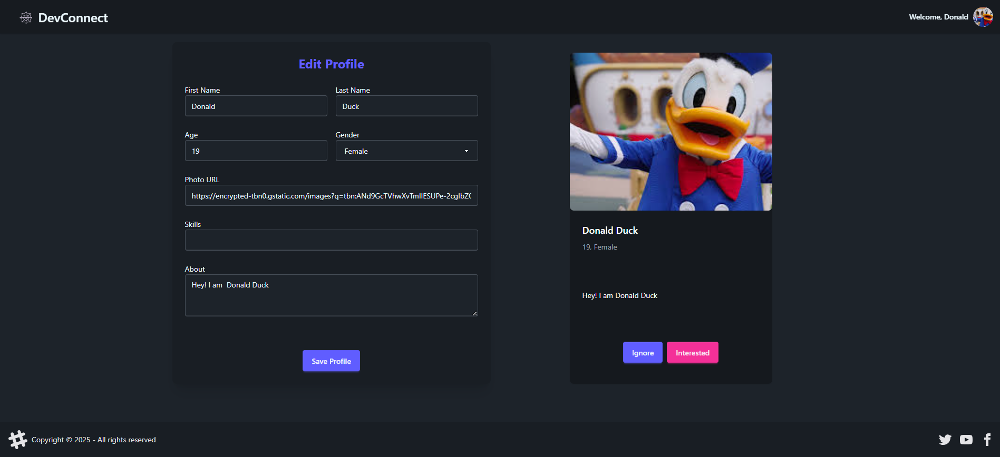
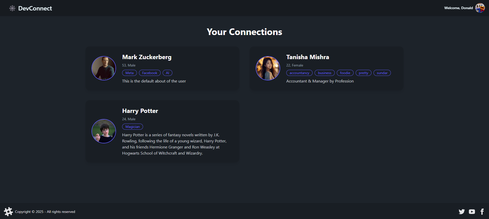
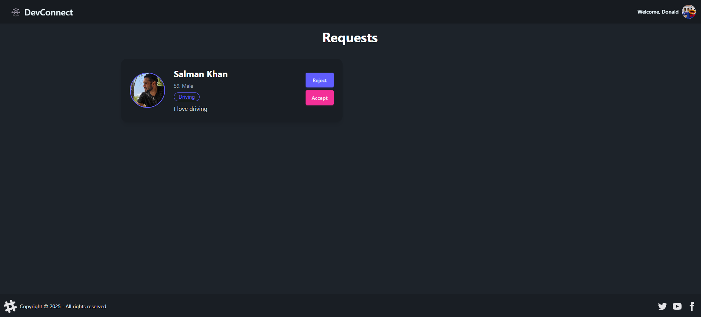
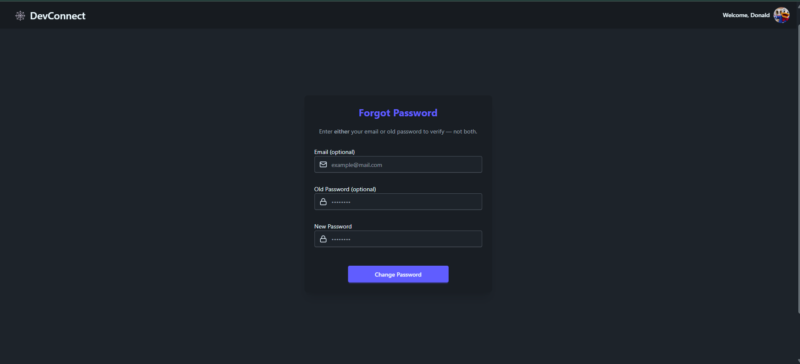
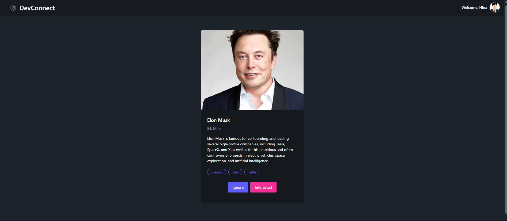

# 🕸️DevConnect - A Networking Platform for Developers

DevConnect is a full-stack MERN application designed to help developers connect with each other. It provides a "Tinder-like" interface for discovering and interacting with other developers, allowing users to build their professional network. The application features a secure backend with JWT authentication and a responsive frontend built with React and Redux.

## Key Features

* **User Authentication:** Secure user registration and login system using JWT (JSON Web Tokens) for authentication.
* **Profile Management:** Users can create and update their profiles with personal information such as their name, age, gender, skills, and a short bio.
* **Developer Feed:** A dynamic feed that displays profiles of other developers on the platform, allowing users to discover new connections.
* **Connection Requests:** Users can send, accept, or reject connection requests, enabling them to build a network of professional contacts.
* **View Connections:** A dedicated page to view all accepted connections.
* **Password Management:** Users can securely update their password through a "Forgot Password" feature that requires either email or old password verification for authentication.

## Technical Details

* **Frontend:**
    * **Framework:** Built with **React.js** and **Vite** for a fast and modern development experience.
    * **Styling:** Styled using **Tailwind CSS** and **DaisyUI** for a clean and responsive user interface.
    * **State Management:** Utilizes **Redux Toolkit** for efficient global state management and **Redux Persist** to maintain user sessions.
    * **Routing:** Client-side routing is handled by **React Router DOM**.
    * **Utilities:** **Axios** for making API requests, **React Toastify** for displaying notifications, and **Lucide React** for icons.
* **Backend:**
    * **Framework:** Developed with **Node.js** and **Express.js** to create a robust RESTful API.
    * **Database:** **MongoDB** is used as the database, with **Mongoose** as the Object Data Modeling (ODM) library.
    * **API & Authentication:** The API is secured using **JWT** for user authentication and authorization. Passwords are encrypted using **bcrypt**.
    * **Middleware:** **CORS** for handling cross-origin requests and **cookie-parser** for managing cookies.

## API Endpoints

### authRouter

* `POST /signup`
* `POST /login`
* `POST /logout`

### profileRouter

* `GET /profile/view`
* `PATCH /profile/edit`
* `PATCH /profile/forgot-password`

### connectionRequestRouter

* `POST /request/send/:status/:userId`
* `POST /request/review/:status/:requestId`

### userRouter

* `GET /user/connections`
* `GET /user/requests/received`
* `GET /user/feed`

## Snapshots:

<table>
  <tr>
    <td></td>
    <td></td>
    
  </tr>
  <tr>
    <td></td>
    <td></td>
  </tr>
  <tr>
    <td></td>
    <td></td>
  </tr>
  <tr>
    <td></td>
    
  </tr>

     
</table>

---

## Setup Instructions

To run this project locally, follow these steps:

### Prerequisites

* Node.js (v18 or higher)
* npm or yarn
* MongoDB (local instance or a cloud service like MongoDB Atlas)

### Backend Setup

1.  **Clone the backend repository:**
    ```bash
    git clone https://github.com/Deepesh-Gaharwar/DevConnect-backend.git
    cd DevConnect-backend
    ```
2.  **Install dependencies:**
    ```bash
    npm install
    ```
3.  **Create a `.env` file** in the `DevConnect-backend` directory and add the following environment variables:
    ```env
    PORT=4000
    MONGODB_URL=<your_mongodb_connection_string>
    JWT_SECRET=<your_jwt_secret_key>
    CORS_ORIGIN=http://localhost:5173
    ```
4.  **Start the server:**
    ```bash
    npm start
    ```

### Frontend Setup

1.  **Clone the frontend repository:**
    ```bash
    git clone https://github.com/Deepesh-Gaharwar/DevConnect-frontend.git
    cd DevConnect-frontend
    ```
2.  **Install dependencies:**
    ```bash
    npm install
    ```
3.  **Create a `.env` file** in the `DevConnect-frontend` directory and add the backend URL:
    ```env
    VITE_BASE_URL=http://localhost:4000
    ```
4.  **Start the development server:**
    ```bash
    npm run dev
    ```

The application should now be running, with the frontend available at `http://localhost:5173` and the backend at `http://localhost:4000`.